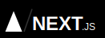

# 🎮 Killer88967

> **Building websites, experimenting with games, and learning something new every day.**

---

## 🧑‍💻 About Me

I’m **Killer88967**, a developer who enjoys building on both the **web** and the **game dev** side.

- 💻 Focused on **full stack web development**
- 🎮 Exploring **game development** and game systems
- 🧠 Always learning new tools, frameworks, and scripting workflows
- 🚀 Interested in building projects that are clean, interactive, and fun to use
- 🎥 Former YouTube creator — might return with devlogs someday

---

## 🧰 Languages & Tools

### Frontend

  
  
  
  
  
  
  

### Backend / Tools

  
  
  
  
  
  
  

---

## 📊 GitHub Stats

 

---

## 🏆 Achievements

  

---

## 🌐 Connect With Me

  
  

---

⭐️ *Keep learning, keep building, and make something awesome every day.*

