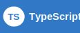
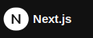
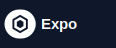
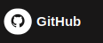
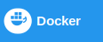
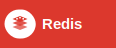
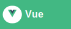
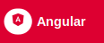

# Hey, I'm Killer88967 👋

I build web projects, get distracted by game dev ideas, and learn a lot by making things.

---

## About Me

I'm someone who likes building things and figuring stuff out as I go.

Most of what I do these days is web development, especially with tools like Next.js, TypeScript, and Tailwind. I also like messing around with game development when I get the chance, mostly because I enjoy building interactive things and seeing ideas turn into something real.

I learn best by working on actual projects, running into problems, and fixing them one by one.

---

## Current Stack

  
  
  
  
  
  
  

  
  
  

This is the stuff I use the most at the moment.

## Currently Learning

  
  
  
  
  

These are some of the things I’ve been learning more about lately.

---

## What I'm Focused On

Right now I'm mostly focused on making better projects, improving how I structure apps, and getting more comfortable with the parts of development that keep changing from project to project.

I'm still learning, but that's part of what makes it fun.

---

## GitHub Stats

  
  

  

---

*Still learning, still building, still improving.*

