

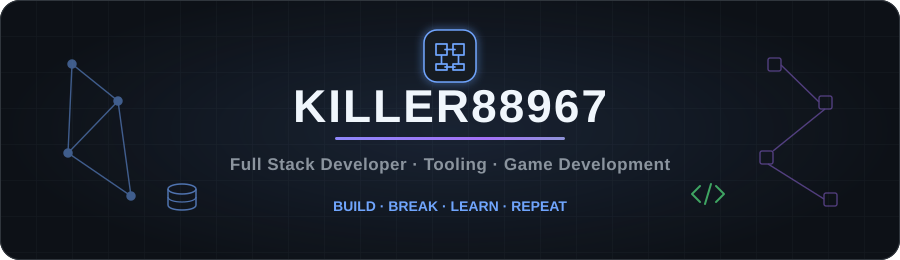

 

 

---

## About Me

I'm a full-stack developer who spends most of my time building web apps, developer tools, Discord systems, frameworks, and games.

I like projects where I can dig below the surface instead of only assembling existing libraries — whether that's designing a database protocol, building a visual editor, creating custom framework tooling, or experimenting with multiplayer game systems.

Currently, a lot of my work revolves around **TypeScript**, **React / Next.js**, **Node.js**, developer tooling, backend architecture, and realtime systems.

---

## Current Projects

<table>
<tr>
<td width="50%" valign="top">

### [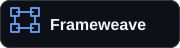](https://github.com/Killer88967/frameweave)

A visual development environment for shaping framework-based projects with a Figma-like workflow while keeping source code in sync.

`TypeScript` `React` `VS Code`

</td>
<td width="50%" valign="top">

### [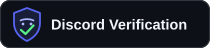](https://github.com/Killer88967/discord-verification)

A self-hosted Discord verification system with browser/device signals, risk policies, linked-account detection, and PostgreSQL-backed persistence.

`TypeScript` `Discord.js` `Next.js` `PostgreSQL`

</td>
</tr>

<tr>
<td width="50%" valign="top">

### [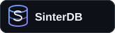](https://github.com/Killer88967/sinterdb)

A document-oriented database project with its own protocol, serialization layer, official Node.js driver, and supporting packages.

`TypeScript` `Node.js` `Protocol Design`

</td>
<td width="50%" valign="top">

### [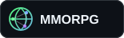](https://github.com/Killer88967/mmorpg)

An experimental multiplayer game project focused on realtime networking, gameplay systems, UI, and persistent worlds.

`TypeScript` `Colyseus` `PixiJS`

</td>
</tr>
</table>

---

## Tech Stack

### Languages & Runtime

  
  &nbsp;
  
  &nbsp;
  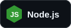

### Frontend

  
  &nbsp;
  
  &nbsp;
  
  &nbsp;
  
  &nbsp;
  
  &nbsp;
  
  &nbsp;
  

### Backend & Databases

  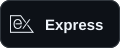
  &nbsp;
  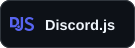
  &nbsp;
  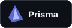
  &nbsp;
  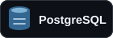
  &nbsp;
  

### Game & Realtime

  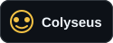
  &nbsp;
  

### Deployment & Infrastructure

  
  &nbsp;
  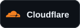

### Development Tools

  
  &nbsp;
  
  &nbsp;
  
  &nbsp;
  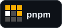

### Currently Exploring

  
  &nbsp;
  
  &nbsp;
  
  &nbsp;
  
  &nbsp;
  

---

## GitHub Stats

 

---

## Achievements

---

### Find Me Elsewhere

&nbsp;

&nbsp;

  

Thanks for stopping by.

